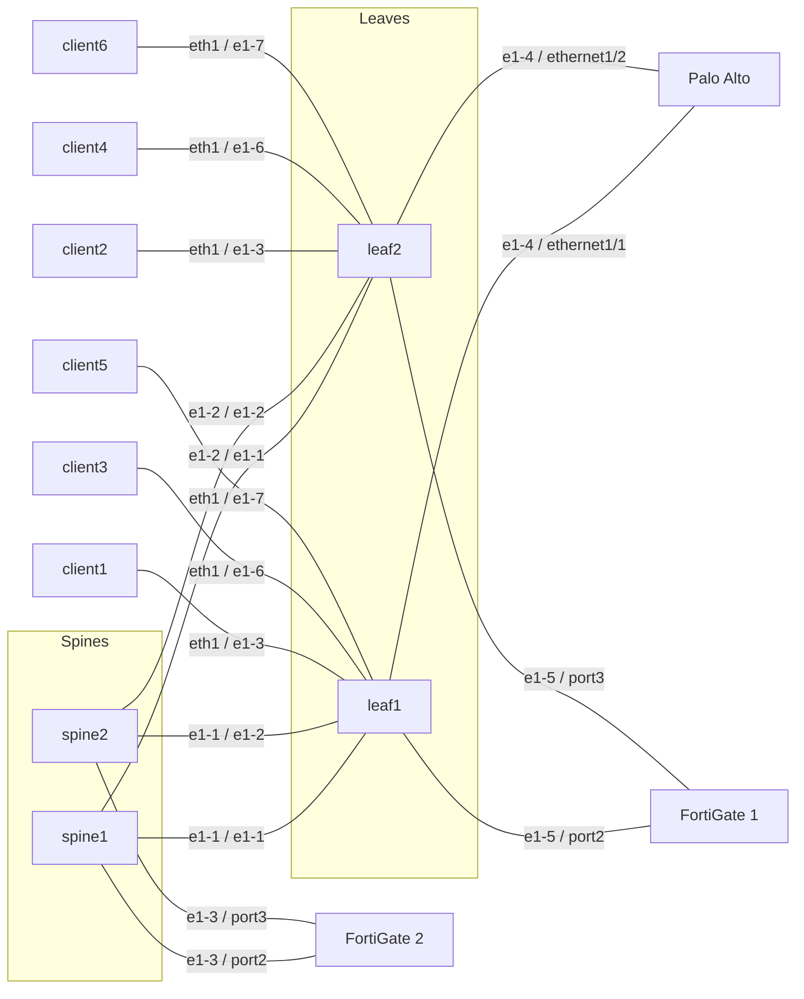

# Firewalls

This lab app is a concept prototype, not a product. The summary, the two use cases, and the production path are in [SUMMARY.md](SUMMARY.md). For production, EDA talks to the firewall API through the Push Pull Provider in EDA 26.12.1.

This file is the `pan-d3l` operational writeup, including the topology diagram.
The resource intents and the collector's Palo Alto and FortiGate API path are in [SUMMARY.md](SUMMARY.md).
Palo Alto and FortiGate are not TopoNodes. Each firewall is a `Firewall`
resource. Each NIC is a `FirewallInterface`.

The Firewall resource is vendor, fabric, and management only. A Firewall
on its own is monitoring only. The collector polls it and does not write
address, VLAN, zone, or BGP. With Configure Firewall on, a Firewall
Interface pushes that NIC, its eBGP neighbor, and any Advanced Networking
services. With it off, the interface is observe only. The Firewall Vendor
selects Palo Alto or FortiGate. Tenant selects the virtual system or VDOM.
Empty uses `vsys1` or `root`.

A classic interface sets Attachment and BGP. Palo Alto and Fortinet-1 fabric
objects, the edge port, the router, and the BGP peer, belong on the virtual
network. The app does not emit them. Advanced Networking on Fortinet-2 has
its own spine port, BGP, address families, and services. It emits the
default interface, address family policy, default BGP group, and default
BGP peer. It does not emit a default router or the spine interface.

VLAN on the Firewall Interface (`spec.vlanID`) is pushed to the firewall.
Empty leaves the port untagged. Palo Alto creates `ethernet1/1.<vlan>`.
FortiGate creates `port2.<vlan>` on that port. Allow Ping is off unless set,
on both vendors. Palo Alto attaches management profile `eda-ping`. FortiGate
adds `ping` to `allowaccess`. When Allow Ping is off, ping does not work.
Deleting the Firewall Interface removes
the pushed address, VLAN interface, zone, BGP neighbor, and `eda-ping` when
nothing else uses that profile. The collector can remove only a NIC it has
recorded. The physical port stays.

## Topology

EDA is Talos #2, `https://100.124.186.55/`, namespace `clab-pan-d3l`. The
firewalls are KVM virtual machines, not containerlab nodes and not EDA
TopoNodes. They run on two hosts:

| Host | Runs | Firewall management |
|------|------|---------------------|
| `nokia@100.124.186.51` (k0r4) | Containerlab: the SR Linux leaves and spines and the clients. The Palo Alto VM (QEMU/KVM, started by `start-fw-vms.sh`). | Palo Alto `https://100.124.186.51:8444` |
| `ubuntu@100.124.186.50` | The two FortiGate VMs (KVM): FortiGate 1 and FortiGate 2. | FortiGate 1 `https://100.124.186.50:8443`, FortiGate 2 `https://100.124.186.50:8445` |

Cable source: `pan-d3l.clab.yml` plus the host bridges in `start-fw-vms.sh`.
Palo Alto is on the same host as the fabric, so its cables are local Linux
bridges (`br-pan-inside`, `br-pan-outside`) between the leaf port and the VM
tap. The FortiGates are on another host, so each FortiGate cable is a Linux
VXLAN tunnel between `.51` and `.50`, IDs 10021 to 10024. That tunnel is
only the lab's stand-in for a patch cable. It is not an EDA virtual network
and not an EVPN VNI, and the fabric does not see it.



Palo Alto runs on `.51`. FortiGate 1 and FortiGate 2 run on `.50`, and
their four cables cross hosts in host tunnels 10021 to 10024.

| Link | Fabric (host tunnel for the cable) | Firewall or client |
|------|--------|--------------------|
| ISL | leaf1 `e1-1` — spine1 `e1-1`, leaf1 `e1-2` — spine2 `e1-1`, leaf2 `e1-1` — spine1 `e1-2`, leaf2 `e1-2` — spine2 `e1-2` | underlay eBGP, pool `ipv4-pool` `12.0.0.0/8` /31 |
| Palo Alto inside | leaf1 `e1-4` | `ethernet1/1`. Address cleared 2026-10-05. Cable remains |
| Palo Alto outside | leaf2 `e1-4` | `ethernet1/2`. Address cleared 2026-10-05. Cable remains |
| client1 | leaf1 `e1-3` | `10.31.1.2/24`, gateway `10.31.1.1` |
| client2 | leaf2 `e1-3` | `10.31.2.2/24`, gateway `10.31.2.1` |
| FortiGate 1 inside | leaf1 `e1-5` (tunnel 10021) | `port2` `10.21.0.1/24` |
| FortiGate 1 outside | leaf2 `e1-5` (tunnel 10022) | `port3` `10.22.0.1/24` |
| client3 | leaf1 `e1-6` | `10.21.0.3/24`, gateway `10.21.0.1` |
| client4 | leaf2 `e1-6` | `10.22.0.2/24`, gateway `10.22.0.1` |
| FortiGate 2 spine link | spine1 `e1-3` (tunnel 10023) | `port2` `10.23.0.1/24`, spine `10.23.0.254` |
| FortiGate 2 spine link | spine2 `e1-3` (tunnel 10024) | `port3` `10.24.0.1/24`, spine `10.24.0.254` |
| FortiGate 2 clients | leaf1 and leaf2 `e1-7` | virtual networks `fg2-local` (VNI 200) and `fg2-remote` (VNI 201) |

| Endpoint | Role | Management |
|----------|------|------------|
| `palo-alto` | Leaf eBGP, one virtual system | `https://100.124.186.51:8444` |
| `fortigate` | Leaf PE/CE. One VLAN and one eBGP session per VDOM | `https://100.124.186.50:8443` |
| `fortigate-2` | EVPN VTEP, eBGP to both spines | `https://100.124.186.50:8445` |

`spec.fabric` is a dropdown of the fabrics in the namespace.

Each interface sets `spec.tenant`. Palo Alto uses a virtual system (`vsys1`).
FortiGate uses a VDOM. Firewall status lists the tenants the collector read.
Both FortiGates are in `multi-vdom` mode. The license on each allows two
VDOMs (`used` 1, `max` 2). Only `root` exists. Creating `service` returned
CMDB error -4, maximum number of entries, so VDOM 2 is not on the box yet.

Clients gateway to the firewall and no default route is advertised. The
fabric gateway on each network is `.254`.

The two FortiGates are not the same role.

FortiGate 1 is standard leaf connectivity. Each tenant is a VDOM. Each VDOM
gets its own VLAN (`spec.vlanID` on the Firewall Interface, and `dot1q` on the leaf) and its own eBGP PE/CE
session to the leaf. It does not join the fabric underlay and it does not
originate the EVPN VTEP. The cables are untagged in VDOM `root`:
`port2` `10.21.0.1/24` and `port3` `10.22.0.1/24`, BGP AS 65201 toward
`.254` remote AS 65001. The VLAN-per-VDOM cutover waits until VDOM 2 exists.

FortiGate 2 is the EVPN firewall. It joins the overlay as a VTEP instead
of hanging off a leaf edge port. Each spine has one routed link to it:
spine1 `e1-3` to `port2` and spine2 `e1-3` to `port3`. On each link EDA
runs an eBGP session from the spine (AS 102) to the FortiGate (AS 65202)
with two address families:

- `ipv4-unicast` carries the FortiGate link subnets, so the leaves can
  reach its VTEP address.
- `evpn` carries the overlay routes for the client virtual networks.

The VNI belongs to EDA, not to the firewall. `fg2-local` and `fg2-remote`
are ordinary virtual networks on leaf `e1-7`. Their bridge domains were
given VNI 200 and 201, EVI 100 and 101, and route targets `target:1:100`
and `target:1:101`. The FortiGate does not build anything from the EVPN
routes it receives: a VTEP only joins an EVPN instance it is configured
for. The collector therefore reads the VNI, EVI, and route target from each
bridge domain and writes the matching FortiGate config in the VDOM named by
the service tenant: `system/evpn` with that EVI and route target,
`system/vxlan` (`vxlan200`, `vxlan201`), and the gateway address on each
VXLAN interface (`10.200.0.1/24`, `10.201.0.1/24`). With the Push Pull
Provider, that write becomes the push.

In `examples/06-fortigate-2-underlay.yaml`, `fortigate-2-local` (`port2`
to spine1) carries both services, and `fortigate-2-remote` (`port3` to
spine2) is the second eBGP session. The VTEP address is the `port2` address
(`10.23.0.1`). A loopback VTEP advertised on both sessions would remove
that dependency on one link, but the prototype does not build it. As of
2026-10-07 both spine sessions are Established, and the FortiGate reports
`vxlan200` and `vxlan201` up.

The FortiGate 2 lab clients are client5 `10.200.0.3/24` (gateway
`10.200.0.1`) and client6 `10.201.0.2/24` (gateway `10.201.0.1`), set in
`start-fw-vms.sh`. As of 2026-10-07 they cannot reach the gateways. EVPN
control plane is up: the leaves list FortiGate 2 (`10.23.0.1`) as the remote
VTEP for VNI 200 and 201. But both leaves route to `10.23.0.0/24` through
spine2, because FortiGate 2 advertises that subnet on both sessions. The
VXLAN packets therefore arrive on `port3`, while `vxlan200` and `vxlan201`
are bound to `port2`, and FortiGate 2 drops them. The fix is a VTEP address
that is valid on both links (a loopback advertised to both spines), or
advertising `10.23.0.0/24` only to spine1.

Palo Alto leaves Advanced Networking empty. On FortiGate 1 the leaf cable
is `dot1q`. On FortiGate 2 the spine links carry the underlay, not a client
VLAN.

Credentials stay in Secrets (`username`, `password`). Examples use `replace-me`.

Firewall communication is the vendor API only. Palo Alto uses the XML API
(`/api/`). FortiGate uses the REST API (`/api/v2`). There is no firewall CLI
or SSH session. These firewalls do not stream gNMI.

## What the UI shows

The Firewalls page reads the state database, not `kubectl`. The collector
(`fwstatus`) polls the vendor API and writes a `FirewallReport`. The report
state script copies that onto the Firewall and each FirewallInterface:

```python
eda.update_cr(
    schema=eda.Schema(group="firewall.eda.labs", version="v1alpha1", kind="Firewall"),
    name=name,
    status={...},
)
```

`eda.Schema` is required. The Firewall and FirewallInterface state scripts
do not publish a hardcoded `Up`. Every kind in the app, including
`FirewallReport`, needs a `status` object in its OpenAPI schema. Without
that, `GET /openapi/v3/apps/firewall.eda.labs/v1alpha1` returns 500 and the
Firewalls page lists nothing. The report spec must name every field the
collector writes (`health`, `bgp`, `events`, `interfaces`, and the rest).
`x-kubernetes-preserve-unknown-fields` does not satisfy the state controller.

`kubectl` status and `fwstatus` with `FWSTATUS_STATE_DB=1` write a different
store. They do not fill the page. Do not run that publisher from `eda-toolbox`.

### Querying status with EQL

Yes. The status the report state script writes is in the EDA database
(EDB), so EQL reads it the same way the page does. Query it from the EDA
Queries page, or with `edactl -n clab-pan-d3l query` in `eda-toolbox`:

```text
.namespace.resources.cr.firewall_eda_labs.v1alpha1.firewall fields [ name, status.operationalState, status.health, status.bgp ]
.namespace.resources.cr.firewall_eda_labs.v1alpha1.firewallinterface fields [ name, status.operationalState, status.message, status.services ]
.namespace.resources.cr.firewall_eda_labs.v1alpha1.firewallreport fields [ name, spec.lastChecked, spec.health ]
.namespace.resources.cr.firewall_eda_labs.v1alpha1.firewallinventory fields [ spec.firewall, spec.type, spec.value ]
```

Add `where ( name = "fortigate-2" )` after the field list to pick one
firewall. EQL wants `fields [ ... ]` before `where ( ... )`. The fabric
side of the FortiGate 2 sessions is node state:

```text
.namespace.node.srl.network-instance.protocols.bgp.neighbor fields [ peer-address, peer-as, session-state ] where ( .namespace.node.name = "spine1" )
```

The State Engine cannot call the firewall HTTPS API. The collector does.
It runs as Deployment `eda-fwstatus` in `eda-system`. Installing the app
does not start that Deployment. `spec.configureFirewall` on an interface
pushes that NIC, including `spec.vlanID`, its eBGP neighbor, and any
Advanced Networking services through the vendor API. Off is observe only.
Fabric AS is the peer AS on the firewall. Firewall AS is the firewall local AS. The collector does not originate a default route. The Virtual Network field lists virtual networks that already exist in the namespace. It does not create one.

## States

The page field `status.operationalState` is this app's rollup, not a vendor
enum. `fwstatus` computes it from the API:

| Rollup | Health | When |
|--------|--------|------|
| `Up` | 100 | API login succeeded and every configured NIC is up |
| `Degraded` | 80 | API ok, and a NIC is up but degraded: its BGP session is not Established, or its address or zone does not match |
| `Degraded` | 70 | API ok, and at least one NIC is down |
| `Degraded` | 40 | API login failed |
| `Degraded` | 50 | The API was attempted without credentials |
| `Down` | 0 | API unreachable |
| `Unknown` | 0 | No credentials, or the NIC was missing from the API response |

EDA cannot show a tooltip on a list cell, so the Firewalls list explains
health in place:

- **Health** shows the value with its meaning from the table above, for
  example `80 · interface degraded`.
- **Health Reason** (`status.healthReason`) is the live cause from the last
  poll. Each interface that is not up is listed with its cause, for example
  `port2: BGP 10.21.0.254 Active; port3: BGP 10.22.0.254 Active`. Below 50
  it is the API error. It is empty at 100.

A NIC `operationalState` is `Up`, `Down`, `Degraded`, or `Unknown`. The port
state comes from the vendor API. When that FirewallInterface has BGP, `Up`
also requires the neighbor in that NIC subnet to be `Established`. A port
that is up with the session down is `Degraded`. An interface without BGP
stays on the port state. The list shows the same circle icon as other EDA
resources: `ArrowUpCircle` for Up, `AlarmCircle` for Degraded,
`ArrowDownCircle` for Down, and `RemoveCircle` for Unknown.

FortiGate interface state is CMDB `system/interface` field `status`: `up` or
`down`. Palo Alto interface state is the operational XML `state` or
`status`: `up` or `down`.

BGP remains a separate list, `status.bgp[].state`, with the session string
from the API. That list does not replace the NIC rollup above. Palo Alto is
`show routing protocol bgp peer` `<status>`. FortiGate is
`/api/v2/monitor/router/bgp/neighbors` field `state`. Both return the BGP
state name. `Established` is the up session. The other names those APIs
return are `Idle`, `Connect`, `Active`, `OpenSent`, and `OpenConfirm`.

Published in `dtrichards01/private-catalog-eda` as
`ghcr.io/dtrichards01/private-eda-registry/firewall:v1.3.3`.
The collector image is `ghcr.io/dtrichards01/private-eda-registry/fwstatus:v1.3.3`.
The UI category is **Firewalls**. Firewall, Node, and Virtual Network are
dropdowns. Interface under Attachment or Advanced Networking lists the
interfaces of the selected node. Once Firewall is set, the Firewall
Interface name lists that firewall's physical ports and Tenant lists its
virtual systems or VDOMs. Both lists come from `FirewallInventory` rows the
collector writes, one row per port or tenant, because EDA autocomplete
returns one value per row and cannot read a list inside one object.

On 2026-10-05 the Palo Alto Firewall Interfaces were deleted in EDA before
the collector had recorded the push, so the box kept `10.31.1.1/24`,
`10.31.2.1/24`, zones `inside` and `outside`, profile `eda-ping`, and BGP
peer group `eda`. Those were removed through the API. The physical
`ethernet1/1` and `ethernet1/2` remain, with no address. FortiGate 1 still
has `port2` `10.21.0.1/24` and `port3` `10.22.0.1/24` in VDOM `root`.
FortiGate 2 still has `port2` `10.23.0.1/24` and `port3` `10.24.0.1/24`.
Both FortiGates are `multi-vdom` and only `root` exists. The license allows
one extra VDOM. Do not factory-reset, and do not add a default route.
