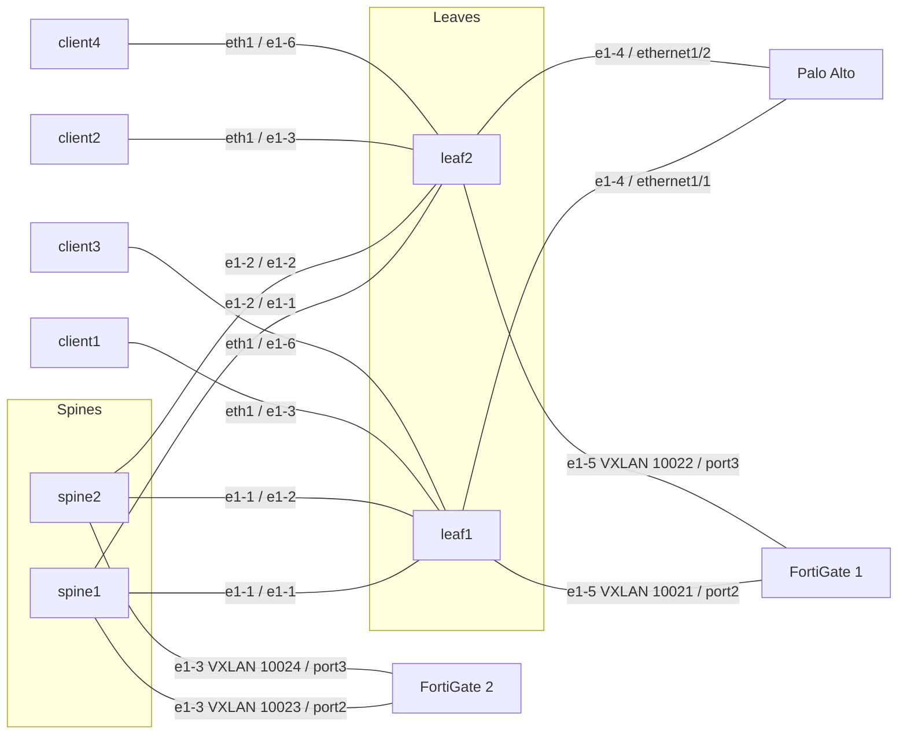

# Firewalls

This lab app is a concept prototype, not a product. The summary, the two use cases, and the production path are in [SUMMARY.md](SUMMARY.md). For production, EDA talks to the firewall API through the Push Pull Provider in EDA 26.12.1.

This file is the `pan-d3l` operational writeup, including the topology diagram.
The resource intents and the collector's Palo Alto and FortiGate API path are in [SUMMARY.md](SUMMARY.md).
Palo Alto and FortiGate are not TopoNodes. Each firewall is a `Firewall`
resource. Each NIC is a `FirewallInterface`.

A Firewall on its own is monitoring only. The collector polls it and does
not write address, VLAN, zone, or BGP. A Firewall Interface pushes that NIC
when Configure Firewall is set, and pushes eBGP when BGP mode is `ebgp`.
The Firewall Vendor selects Palo Alto or FortiGate. Tenant selects the
virtual system or VDOM. Empty uses `vsys1` or `root`.

Palo Alto and Fortinet-1 fabric objects, the edge port, the router, and the
BGP peer, belong on the virtual network. The app does not emit them.
Advanced Networking on Fortinet-2 emits the default interface, EVPN policy,
default BGP group, and default BGP peer. It does not emit a default router
or the spine interface.

VLAN on the Firewall Interface (`spec.vlanID`) is pushed to the firewall.
Empty leaves the port untagged. Palo Alto creates `ethernet1/1.<vlan>`.
FortiGate creates `port2.<vlan>` on that port. Allow Ping is off unless set.
On Palo Alto it attaches management profile `eda-ping`, and that NIC answers
ping. When Allow Ping is off, the profile is not attached and ping does not
work. Deleting the Firewall Interface removes
the pushed address, VLAN interface, zone, BGP neighbor, and `eda-ping` when
nothing else uses that profile. The collector can remove only a NIC it has
recorded. The physical port stays.

## Topology

EDA is Talos #2, `https://100.124.186.55/`, namespace `clab-pan-d3l`.
Containerlab runs on `nokia@100.124.186.51`. The firewalls are KVM VMs on
`ubuntu@100.124.186.50`, not containerlab nodes. Cable source:
`pan-d3l.clab.yml` plus the host bridges in `start-fw-vms.sh`.



| Link | Fabric | Firewall or client |
|------|--------|--------------------|
| ISL | leaf1 `e1-1` — spine1 `e1-1`, leaf1 `e1-2` — spine2 `e1-1`, leaf2 `e1-1` — spine1 `e1-2`, leaf2 `e1-2` — spine2 `e1-2` | underlay eBGP, pool `ipv4-pool` `12.0.0.0/8` /31 |
| Palo Alto inside | leaf1 `e1-4` | `ethernet1/1`. Address cleared 2026-10-05. Cable remains |
| Palo Alto outside | leaf2 `e1-4` | `ethernet1/2`. Address cleared 2026-10-05. Cable remains |
| client1 | leaf1 `e1-3` | `10.31.1.2/24`, gateway `10.31.1.1` |
| client2 | leaf2 `e1-3` | `10.31.2.2/24`, gateway `10.31.2.1` |
| FortiGate 1 inside | leaf1 `e1-5`, VXLAN VNI `10021` | `port2` `10.21.0.1/24` |
| FortiGate 1 outside | leaf2 `e1-5`, VXLAN VNI `10022` | `port3` `10.22.0.1/24` |
| client3 | leaf1 `e1-6` | `10.21.0.3/24`, gateway `10.21.0.1` |
| client4 | leaf2 `e1-6` | `10.22.0.2/24`, gateway `10.22.0.1` |
| FortiGate 2 underlay | spine1 `e1-3`, VXLAN VNI `10023` | `port2` `10.23.0.1/24`, fabric `10.23.0.254` |
| FortiGate 2 underlay | spine2 `e1-3`, VXLAN VNI `10024` | `port3` `10.24.0.1/24`, fabric `10.24.0.254` |
| FortiGate 2 clients | leaf1 and leaf2 `e1-7` | VNETs `fg2-local` VNI 208 and `fg2-remote` VNI 207 |

| Endpoint | Role | Management |
|----------|------|------------|
| `palo-alto` | Leaf eBGP, one virtual system | `https://100.124.186.51:8444` |
| `fortigate` | Leaf PE/CE. One VLAN and one eBGP session per VDOM | `https://100.124.186.50:8443` |
| `fortigate-2` | EVPN underlay from the spines | `https://100.124.186.50:8445` |

`spec.fabric` is a dropdown of the fabrics in the namespace.

Each interface sets `spec.tenant`. Palo Alto uses a virtual system (`vsys1`).
FortiGate uses a VDOM. Both FortiGates are in `multi-vdom` mode. The license
on each allows two VDOMs (`used` 1, `max` 2). Only `root` exists. Creating
`service` returned CMDB error -4, maximum number of entries, so VDOM 2 is
not on the box yet.

Each tenant has one route handoff. `clients-use-firewall` is the lab default:
clients gateway to the firewall and no default route is advertised.
`firewall-originates-default` tells the firewall BGP session to advertise
`0.0.0.0/0`. `fabric-static-to-firewall` is the fabric static toward the
firewall address. Only one of those is selected.

Palo Alto tenants use eBGP to a virtual network. The fabric gateway on each
network is `.254`.

The two FortiGates are not the same role.

FortiGate 1 is standard leaf connectivity. Each tenant is a VDOM. Each VDOM
gets its own VLAN (`spec.vlanID` on the Firewall Interface, and `dot1q` on the leaf) and its own eBGP PE/CE
session to the leaf. It does not join the fabric underlay and it does not
originate the EVPN VTEP. The cables are untagged in VDOM `root`:
`port2` `10.21.0.1/24` and `port3` `10.22.0.1/24`, BGP AS 65201 toward
`.254` remote AS 65001. The VLAN-per-VDOM cutover waits until VDOM 2 exists.

FortiGate 2 is the EVPN firewall. The fabric underlay extends into it on
interlinks to the spines: spine1 `e1-3` to `port2` (VXLAN VNI 10023) and
spine2 `e1-3` to `port3` (VXLAN VNI 10024). Those are not leaf edge ports
and they are not client gateways. iBGP to the spine route reflectors and
the VTEP belong on this firewall. Client VNETs are `fg2-local` and
`fg2-remote` on leaf `e1-7`. The spine links are the underlay.

Palo Alto leaves Advanced Networking empty. A FortiGate EVPN VDOM uses
**Advanced Networking** (`underlay: evpn-vxlan`). On FortiGate 1 the leaf
cable is `dot1q`. On FortiGate 2 the spine links carry the underlay, not a
client VLAN.

Credentials stay in Secrets (`username`, `password`). Examples use `replace-me`.

Firewall communication is the vendor API only. Palo Alto uses the XML API
(`/api/`). FortiGate uses the REST API (`/api/v2`). There is no firewall CLI
or SSH session. These firewalls do not stream gNMI.

## What the UI shows

The Firewalls page reads the state database, not `kubectl`. The collector
(`fwstatus`) polls the vendor API and writes a `FirewallReport`. The report
state script copies that onto the Firewall and each FirewallInterface:

```python
eda.update_cr(
    schema=eda.Schema(group="firewall.eda.labs", version="v1alpha1", kind="Firewall"),
    name=name,
    status={...},
)
```

`eda.Schema` is required. The Firewall and FirewallInterface state scripts
do not publish a hardcoded `Up`. Every kind in the app, including
`FirewallReport`, needs a `status` object in its OpenAPI schema. Without
that, `GET /openapi/v3/apps/firewall.eda.labs/v1alpha1` returns 500 and the
Firewalls page lists nothing. The report spec must name every field the
collector writes (`health`, `bgp`, `events`, `interfaces`, and the rest).
`x-kubernetes-preserve-unknown-fields` does not satisfy the state controller.

`kubectl` status and `fwstatus` with `FWSTATUS_STATE_DB=1` write a different
store. They do not fill the page. Do not run that publisher from `eda-toolbox`.

The State Engine cannot call the firewall HTTPS API. The collector does.
It runs as Deployment `eda-fwstatus` in `eda-system`. Installing the app
does not start that Deployment. `spec.configureFirewall` on an interface
pushes that NIC, including `spec.vlanID`, through the vendor API. BGP mode
`ebgp` pushes the neighbor. Fabric AS is the peer AS on the firewall. Firewall AS is the firewall local AS. The collector does not originate a default route. The Virtual Network field lists virtual networks that already exist in the namespace. It does not create one.

## States

The page field `status.operationalState` is this app's rollup, not a vendor
enum. `fwstatus` computes it from the API:

| Rollup | Health | When |
|--------|--------|------|
| `Up` | 100 | API login succeeded and every configured NIC is up |
| `Degraded` | 80 | API ok, and a NIC is up but its BGP session is not |
| `Degraded` | 70 | API ok, and at least one NIC is down |
| `Degraded` | 40 | API login failed |
| `Degraded` | 50 | The API was attempted without credentials |
| `Down` | 0 | API unreachable |
| `Unknown` | 0 | No credentials, or the NIC was missing from the API response |

A NIC `operationalState` is `Up`, `Down`, `Degraded`, or `Unknown`. The port
state comes from the vendor API. When that FirewallInterface has BGP, `Up`
also requires the neighbor in that NIC subnet to be `Established`. A port
that is up with the session down is `Degraded`. An interface without BGP
stays on the port state. The list shows the same circle icon as other EDA
resources: `ArrowUpCircle` for Up, `AlarmCircle` for Degraded,
`ArrowDownCircle` for Down, and `RemoveCircle` for Unknown.

FortiGate interface state is CMDB `system/interface` field `status`: `up` or
`down`. Palo Alto interface state is the operational XML `state` or
`status`: `up` or `down`.

BGP remains a separate list, `status.bgp[].state`, with the session string
from the API. That list does not replace the NIC rollup above. Palo Alto is
`show routing protocol bgp peer` `<status>`. FortiGate is
`/api/v2/monitor/router/bgp/neighbors` field `state`. Both return the BGP
state name. `Established` is the up session. The other names those APIs
return are `Idle`, `Connect`, `Active`, `OpenSent`, and `OpenConfirm`.

Published in `dtrichards01/private-catalog-eda` as
`ghcr.io/dtrichards01/private-eda-registry/firewall:v1.2.10`.
The collector image stays `ghcr.io/dtrichards01/private-eda-registry/fwstatus:v1.2.8`.
The UI category is **Firewalls**. There is no Bridge field. Node and
Interface on an attachment are pickers: the interface list is the
interfaces of the selected node.

On 2026-10-05 the Palo Alto Firewall Interfaces were deleted in EDA before
the collector had recorded the push, so the box kept `10.31.1.1/24`,
`10.31.2.1/24`, zones `inside` and `outside`, profile `eda-ping`, and BGP
peer group `eda`. Those were removed through the API. The physical
`ethernet1/1` and `ethernet1/2` remain, with no address. FortiGate 1 still
has `port2` `10.21.0.1/24` and `port3` `10.22.0.1/24` in VDOM `root`.
FortiGate 2 still has `port2` `10.23.0.1/24` and `port3` `10.24.0.1/24`.
Both FortiGates are `multi-vdom` and only `root` exists. The license allows
one extra VDOM. Do not factory-reset, and do not add a default route.
