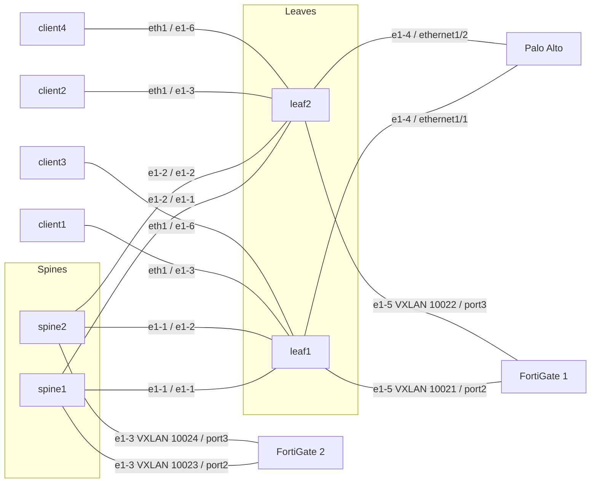

# Firewall prototype

This is a concept prototype, not a product. The feature set is limited and
covers two lab use cases on Talos EDA #2, namespace `clab-pan-d3l`.

For production, the interface between EDA and the firewall API will be the
Push Pull Provider in EDA 26.12.1. The collector in this prototype
(`fwstatus`) is a lab stand-in for that interface.

Operational detail and the same topology diagram are also in
[README.md](README.md).

## Use case 1 — General firewall

An external firewall attaches to edge interfaces. Palo Alto and FortiGate 1
are this shape.

The virtual network owns the fabric service: the edge port, the router, the
routed or IRB interface, and the eBGP peer. This app does not create that
virtual network and does not emit those objects. Build the virtual network
first. The Virtual Network field lists virtual networks that already exist.

A Firewall with no Firewall Interface is monitoring only. A Firewall
Interface pushes the NIC when Configure Firewall is set, and pushes eBGP
when BGP mode is `ebgp`. Vendor on the Firewall selects Palo Alto or
FortiGate. Tenant selects the virtual system or VDOM. Empty uses `vsys1` or
`root`.

The firewall API write is address, VLAN, zone, optional ping, and the eBGP
neighbor. Fabric AS is the peer AS. Firewall AS is the firewall local AS.
The app does not originate a default route. Deleting the Firewall Interface
removes the config the collector has recorded. The physical port stays.

## Use case 2 — FortiGate on the spine underlay

FortiGate 2 attaches to the spines, not to leaf edge ports. Client virtual
networks stay on the leaves. Advanced Networking emits the default
interface, EVPN policy, default BGP group, and default BGP peer. It does
not emit a default router or the spine interface. BGP on the firewall is
eBGP, plus EVPN only when Advanced Networking is set.

## Topology

Use case 1 is Palo Alto (`ethernet1/1`, `ethernet1/2`) and FortiGate 1
(`port2`, `port3` on the leaves). Use case 2 is FortiGate 2 (`port2`,
`port3` on the spines).

## Limited feature set

- Palo Alto XML API and FortiGate REST API only. No CLI, SSH, or gNMI.
- No virtual network, VDOM, or virtual system is created. A second FortiGate
  VDOM and a second Palo Alto virtual system have to exist before a push.
- Tenant is free text. There is no VDOM or vsys dropdown.
- Allow Ping is off unless set. On Palo Alto that attaches management
  profile `eda-ping`. When it is off, ping does not work.
- VLAN is optional. Empty leaves the port untagged.
- The collector removes a NIC only after it has recorded the push.
- Gateway addressing is `.254` in the NIC subnet (`.253` when the firewall
  itself is `.254`).
