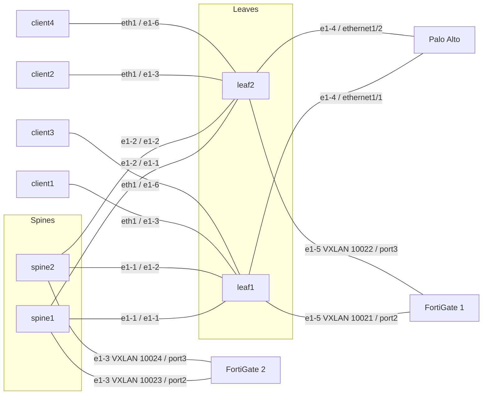

# Firewall prototype

This is a concept prototype, not a product. The feature set is limited and
covers two lab use cases on Talos EDA #2, namespace `clab-pan-d3l`.

For production, the interface between EDA and the firewall API will be the
Push Pull Provider in EDA 26.12.1. The collector in this prototype
(`fwstatus`) is a lab stand-in for that interface.

Operational detail and the same topology diagram are also in
[README.md](README.md).

## Use case 1 — General firewall

An external firewall attaches to edge interfaces. Palo Alto and FortiGate 1
are this shape.

The virtual network owns the fabric service: the edge port, the router, the
routed or IRB interface, and the eBGP peer. This app does not create that
virtual network and does not emit those objects. Build the virtual network
first. The Virtual Network field lists virtual networks that already exist.

The Firewall resource is identity and management only: vendor, fabric, API
URL, and credential Secret. Addresses, tenants, and BGP live on each
Firewall Interface. A Firewall with no Firewall Interface is monitoring only.

A classic Firewall Interface sets Attachment (leaf node, port, existing
virtual network, encapsulation, VLAN) and, optionally, BGP (Fabric AS and
Firewall AS, always eBGP). With Configure Firewall on, the collector writes
the address, VLAN, zone, ping, and the eBGP neighbor in the selected tenant.
With Configure Firewall off, the interface is observe only: the collector
reports port and BGP state and writes nothing. Tenant is the virtual system
or VDOM. Empty uses `vsys1` or `root`.

Fabric AS is the peer AS on the firewall. Firewall AS is the firewall local
AS. The app does not originate a default route. Deleting the Firewall
Interface removes the config the collector has recorded. The physical port
stays.

## Use case 2 — FortiGate on the spine underlay

FortiGate 2 attaches to the spines, not to leaf edge ports. Client virtual
networks stay on the leaves. A Firewall Interface with Advanced Networking
has its own section: spine node and port, encapsulation and VLAN, BGP
(Fabric AS, Firewall AS, address families), and services. Attachment and
classic BGP stay empty.

The intent builds the spine default interface, a policy for the chosen
address families, the default BGP group, and the default BGP peer. It does
not build a default router or the spine interface. Families default to
`ipv4-unicast` (the VTEP subnet) and `evpn` (the services).

One underlay port carries many services. Each service is a tenant (the
VDOM) and an existing client virtual network. The collector reads that
network's bridge domain and pushes the same VNI, EVI, and route target to
the FortiGate: an EVPN instance, a VXLAN interface `vxlan<vni>` sourced from
the underlay port, and the service address on that interface. An expected
VNI on the service is optional and has to match the bridge domain. The
collector also advertises the underlay port subnet in BGP so the leaves can
reach the FortiGate VXLAN source.

The lab demo stays in VDOM `root`. Inside and outside are two services
(`fg2-local` and `fg2-remote`) on different VNIs over the same EVPN
sessions, not extra BGP sessions or a second VDOM.

## Topology

Use case 1 is Palo Alto (`ethernet1/1`, `ethernet1/2`) and FortiGate 1
(`port2`, `port3` on the leaves). Use case 2 is FortiGate 2 (`port2`,
`port3` on the spines).

## Resources and intents

Three resources:

| Resource | Role |
|----------|------|
| Firewall | One external firewall. Vendor is `paloalto` or `fortinet`. Management is the API URL and the credential Secret. Status lists the tenants read from the firewall. A Firewall alone is monitoring only. |
| Firewall Interface | One NIC. Classic sets Attachment and BGP. Advanced Networking sets the spine port, BGP, families, and services. Configure Firewall on writes to the firewall; off is observe only. |
| Firewall Report | What the collector last read and wrote. The UI does not read this object directly. |

Five intents. The state scripts on Firewall and Firewall Interface do nothing, so they cannot overwrite the collector with a hardcoded Up.

| Intent | Role |
|--------|------|
| Firewall config | Checks the Firewall. It does not create a virtual network, router, or BGP peer. |
| Firewall state | No-op. Status comes from the report. |
| Firewall Interface config | Checks the interface. Classic emits nothing on the fabric. Advanced Networking emits the spine default interface, address family policy, default BGP group, and default BGP peer, and checks each service's expected VNI against its bridge domain. |
| Firewall Interface state | No-op. Status comes from the report. |
| Firewall Report state | Copies the collector report onto the Firewall and each Firewall Interface. That is what the Firewalls page reads. |

## Collector and the two APIs

`fwstatus` runs as Deployment `eda-fwstatus` in `eda-system`. Installing the app does not start it. It polls about once a minute. The State Engine cannot call the firewall.

Each poll, for each Firewall:

1. Read the vendor, the API URL, and the Secret (`username`, `password`).
2. Read the bridge domain of each Advanced Networking service for its VNI, EVI, and route target.
3. Split Firewall Interfaces into live and deleting.
4. Withdraw NICs recorded on a previous push and no longer live, and services a live NIC no longer lists. Remove the finalizer after that succeeds.
5. For live NICs with Configure Firewall on: push the NIC, the eBGP neighbor, and the VXLAN services. Configure Firewall off writes nothing.
6. Read health, interfaces, BGP state, and tenants back from the API.
7. Write a Firewall Report. The report state intent publishes that onto the UI.

The Firewall `spec.vendor` selects the API. Tenant selects where the push goes. Empty tenant is Palo Alto `vsys1` or FortiGate `root`.

Palo Alto uses the XML API (`/api/`). The collector logs in with a key, sets candidate config, and commits. Untagged address is a layer3 IP entry on the physical port. A VLAN is a subinterface (`ethernet1/1.21`). Allow Ping creates profile `eda-ping` and attaches it. BGP uses the `default` virtual router: Firewall AS is `local-as`, Fabric AS is the peer AS, and the peer address is the fabric gateway (`.254`). `vsys1` uses the device virtual-router path. Another vsys uses that vsys path. This lab only has `vsys1`.

FortiGate uses the REST API (`/api/v2`). The collector logs in and sends CMDB calls with `?vdom=` set to the tenant. A VLAN is a separate interface (`port2.21`) on the parent port. Allow Ping adds `ping` to `allowaccess`. BGP is a small update of AS and router-id, then a neighbor whose IP is the fabric gateway, whose remote AS is the Fabric AS, and whose interface is the port or VLAN interface. `activate` follows `ipv4-unicast` and `activate-evpn` follows `evpn`. Classic sessions are IPv4 only. An Advanced Networking service is `system/evpn` (EVI and route target), `system/vxlan` (`vxlan<vni>`, VNI, EVPN id, underlay port as source), and the address on that VXLAN interface. With `ipv4-unicast`, the underlay subnet is a `router/bgp/network` entry. The collector does not originate a default route on either vendor.

Tenants in Firewall status come from Palo Alto `vsys` entries and FortiGate `system/vdom`.

A delete removes only a NIC the collector has recorded, on the next poll. The physical port stays. Palo Alto drops the address, zone member, BGP peer, VLAN unit, and `eda-ping` when nothing else uses it. FortiGate removes the VXLAN interfaces and EVPN instances first, then the advertised subnet, the neighbor, and the VLAN interface, or clears the address on an untagged port. `port1` is never cleared.

## Limited feature set

- Palo Alto XML API and FortiGate REST API only. No CLI, SSH, or gNMI.
- No virtual network, VDOM, or virtual system is created. A second FortiGate
  VDOM and a second Palo Alto virtual system have to exist before a push.
- Tenant is free text. Firewall status lists the tenants the collector
  read, but the form has no tenant dropdown yet, and no interface dropdown
  filtered by the chosen firewall. Both need the collector's lists to be
  queryable from the form.
- Firewall, Node, and Virtual Network are dropdowns.
- Allow Ping is off unless set, on both vendors. Palo Alto attaches
  management profile `eda-ping`. FortiGate adds `ping` to `allowaccess`.
  When it is off, ping does not work.
- Advanced Networking services are FortiGate only, and in the same VDOM as
  the underlay port.
- VLAN is optional. Empty leaves the port untagged.
- The collector removes a NIC only after it has recorded the push.
- Gateway addressing is `.254` in the NIC subnet (`.253` when the firewall
  itself is `.254`).
