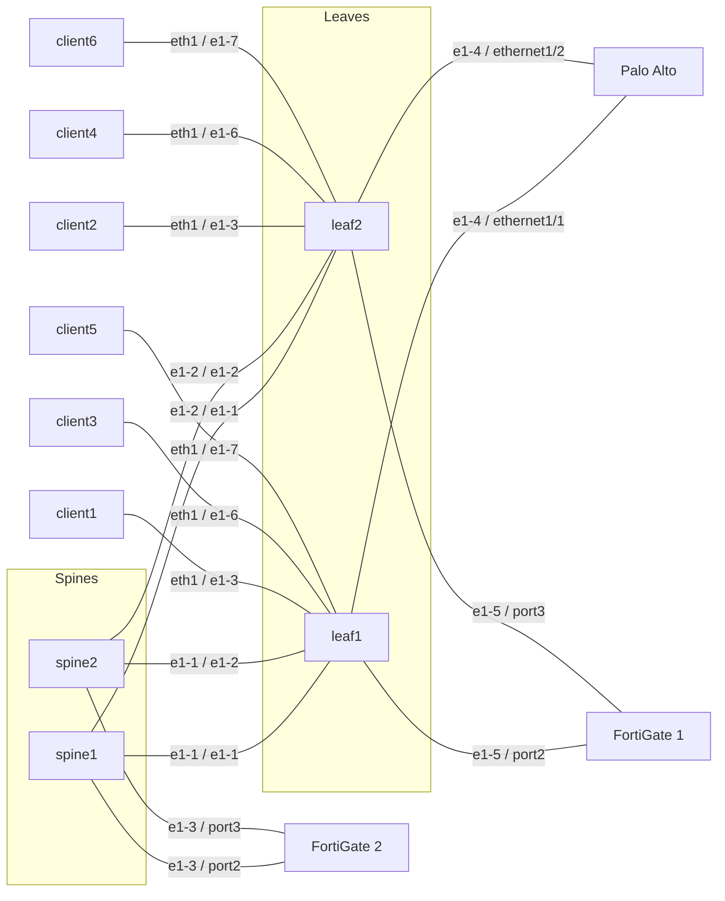

# Firewall prototype

This is a concept prototype, not a product. The feature set is limited and
covers two lab use cases on Talos EDA #2, namespace `clab-pan-d3l`.

For production, the interface between EDA and the firewall API will be the
Push Pull Provider in EDA 26.12.1. The collector in this prototype
(`fwstatus`) is a lab stand-in for that interface.

Operational detail and the same topology diagram are also in
[README.md](README.md).

## Use case 1 — General firewall

An external firewall attaches to edge interfaces. Palo Alto and FortiGate 1
are this shape.

The virtual network owns the fabric service: the edge port, the router, the
routed or IRB interface, and the eBGP peer. This app does not create that
virtual network and does not emit those objects. Build the virtual network
first. The Virtual Network field lists virtual networks that already exist.

The Firewall resource is identity and management only: vendor, fabric, API
URL, and credential Secret. Addresses, tenants, and BGP live on each
Firewall Interface. A Firewall with no Firewall Interface is monitoring only.

A classic Firewall Interface sets Attachment (leaf node, port, existing
virtual network, encapsulation, VLAN) and, optionally, BGP (Fabric AS and
Firewall AS, always eBGP). With Configure Firewall on, the collector writes
the address, VLAN, zone, ping, and the eBGP neighbor in the selected tenant.
With Configure Firewall off, the interface is observe only: the collector
reports port and BGP state and writes nothing. Tenant is the virtual system
or VDOM. Empty uses `vsys1` or `root`.

Fabric AS is the peer AS on the firewall. Firewall AS is the firewall local
AS. The app does not originate a default route. Deleting the Firewall
Interface removes the config the collector has recorded. The physical port
stays.

## Use case 2 — FortiGate as an EVPN VTEP on the spines

FortiGate 2 joins the overlay as a VTEP. It is cabled to the spines, not
to leaf edge ports, and client virtual networks stay on the leaves. The
model is: eBGP from each spine to the firewall with the `evpn` family, the
VNI owned by the EDA virtual network, and the firewall mapping that VNI to
a VDOM.

The VNI is not learned by the firewall. A VTEP joins only the EVPN
instances it is configured for, so something has to write the EVPN instance
and VXLAN interface onto the FortiGate. In the prototype that is the
collector. In production it is the Push Pull Provider.

A Firewall Interface with Advanced Networking has its own section: spine
node and port, encapsulation and VLAN, BGP (Fabric AS, Firewall AS, address
families), and services. Attachment and classic BGP stay empty. The intent
builds the spine default interface, a policy for the chosen address
families, the default BGP group, and the default BGP peer. It does not
build a default router or the spine interface. Families default to:

- `ipv4-unicast`, which carries the firewall link subnet so the leaves can
  reach the VTEP.
- `evpn`, which carries the overlay routes.

Each service is a tenant (the VDOM) and an existing client virtual network.
The collector reads that network's bridge domain for the VNI, EVI, and route
target EDA allocated. It writes the same values to the FortiGate in that
VDOM: an EVPN instance, a VXLAN interface `vxlan<vni>` sourced from the
link port, and the service gateway address on that interface. An expected
VNI on the service is optional and has to match the bridge domain.

The lab demo stays in VDOM `root`. `fg2-local` (VNI 200) and `fg2-remote`
(VNI 201) are two services over the same EVPN sessions, not extra BGP
sessions or a second VDOM.

The VTEP should be a loopback. With the `port2` link address as the VTEP,
the leaves reach it through whichever spine they prefer. VXLAN that
arrives on `port3` is dropped, because the VXLAN interfaces are bound to
`port2`. That is the lab state today. With a VTEP address set, the
collector creates loopback `eda-vtep` (`/32`) in the VDOM, sources the
VXLAN interfaces from it, and advertises the `/32` on both sessions instead
of the link subnet. The field is `advanced.vtepAddress` (v1.3.7). The
FortiGate 2 evaluation license refuses the loopback, so the lab does not
use it yet. The link address cannot replace it, because SR Linux does not
accept a route whose prefix contains its own next hop. Each spine accepts
only the other FortiGate link subnet, so VXLAN to `10.23.0.1` arrives on
`port3`, where FortiGate 2 drops it.

## Topology

The firewalls are KVM virtual machines, not containerlab nodes:

| Host | Runs |
|------|------|
| `100.124.186.51` (k0r4) | Containerlab (SR Linux leaves, spines, clients) and the Palo Alto VM |
| `100.124.186.50` | FortiGate 1 and FortiGate 2 VMs |

Palo Alto cables are local Linux bridges on `.51`. Each FortiGate cable
crosses from `.51` to `.50` in a Linux VXLAN tunnel (IDs 10021 to 10024).
That tunnel only stands in for a patch cable. It is not an EDA virtual
network or an EVPN VNI.

Use case 1 is Palo Alto on `.51` (`ethernet1/1`, `ethernet1/2`) and
FortiGate 1 on `.50` (`port2`, `port3` on the leaves). Use case 2 is
FortiGate 2 on `.50` (`port2`, `port3` on the spines, eBGP with
`ipv4-unicast` and `evpn`). Its clients are on leaf `e1-7` in `fg2-local`
and `fg2-remote`.

## Resources and intents

Four resources:

| Resource | Role |
|----------|------|
| Firewall | One external firewall. Vendor is `paloalto` or `fortinet`. Management is the API URL and the credential Secret. Status has the state, health, a health reason naming each interface that is not up, and the tenants read from the firewall. A Firewall alone is monitoring only. |
| Firewall Interface | One NIC. Classic sets Attachment and BGP. Advanced Networking sets the spine port, BGP, families, and services. Configure Firewall on writes to the firewall; off is observe only. |
| Firewall Report | What the collector last read and wrote. The UI does not read this object directly. |
| Firewall Inventory | One row per firewall port or tenant, written by the collector. The Firewall Interface name and Tenant dropdowns read it. |

Every kind needs a `status` object in its OpenAPI schema, even one the UI
does not list. If one kind has none, EDA cannot generate the app OpenAPI
and the whole Firewalls category disappears from the UI.

Firewall and Firewall Interface status is in the EDA database, so EQL can
query it, for example
`.namespace.resources.cr.firewall_eda_labs.v1alpha1.firewall fields [ name, status.operationalState, status.health ]`.
More queries are in [README.md](README.md).

Five intents. The state scripts on Firewall and Firewall Interface do nothing, so they cannot overwrite the collector with a hardcoded Up.

| Intent | Role |
|--------|------|
| Firewall config | Checks the Firewall. It does not create a virtual network, router, or BGP peer. |
| Firewall state | No-op. Status comes from the report. |
| Firewall Interface config | Checks the interface. Classic emits nothing on the fabric. Advanced Networking emits the spine default interface, address family policy, default BGP group, and default BGP peer, and checks each service's expected VNI against its bridge domain. |
| Firewall Interface state | No-op. Status comes from the report. |
| Firewall Report state | Copies the collector report onto the Firewall and each Firewall Interface. That is what the Firewalls page reads. |

## Collector and the two APIs

`fwstatus` runs as Deployment `eda-fwstatus` in `eda-system`. Installing the app does not start it. It polls every 30 seconds (`-interval` in `deploy/collector.yaml`). The State Engine cannot call the firewall.

Each poll, for each Firewall:

1. Read the vendor, the API URL, and the Secret (`username`, `password`).
2. Read the bridge domain of each Advanced Networking service for its VNI, EVI, and route target.
3. Split Firewall Interfaces into live and deleting.
4. Withdraw NICs recorded on a previous push and no longer live, and services a live NIC no longer lists. Remove the finalizer after that succeeds.
5. For live NICs with Configure Firewall on: push the NIC, the eBGP neighbor, and the VXLAN services. Configure Firewall off writes nothing.
6. Read health, interfaces, BGP state, ports, and tenants back from the API.
7. Write a Firewall Report. The report state intent publishes that onto the UI.
8. Sync the Firewall Inventory rows (ports and tenants) for the dropdowns.

The Firewall `spec.vendor` selects the API. Tenant selects where the push goes. Empty tenant is Palo Alto `vsys1` or FortiGate `root`.

Palo Alto uses the XML API (`/api/`). The collector logs in with a key, sets candidate config, and commits. Untagged address is a layer3 IP entry on the physical port. A VLAN is a subinterface (`ethernet1/1.21`). Allow Ping creates profile `eda-ping` and attaches it. BGP uses the `default` virtual router: Firewall AS is `local-as`, Fabric AS is the peer AS, and the peer address is the fabric gateway (`.254`). `vsys1` uses the device virtual-router path. Another vsys uses that vsys path. This lab only has `vsys1`.

FortiGate uses the REST API (`/api/v2`). The collector logs in and sends CMDB calls with `?vdom=` set to the tenant. A VLAN is a separate interface (`port2.21`) on the parent port. Allow Ping adds `ping` to `allowaccess`. BGP is a small update of AS and router-id, then a neighbor whose IP is the fabric gateway, whose remote AS is the Fabric AS, and whose interface is the port or VLAN interface. `activate` follows `ipv4-unicast` and `activate-evpn` follows `evpn`. Classic sessions are IPv4 only. An Advanced Networking service is `system/evpn` (EVI and route target), `system/vxlan` (`vxlan<vni>`, VNI, EVPN id, underlay port or loopback `eda-vtep` as source), and the address on that VXLAN interface. With `ipv4-unicast`, the VTEP `/32`, or the underlay subnet when there is no VTEP address, is a `router/bgp/network` entry. When the VXLAN source changes and FortiOS refuses the update, the collector deletes and recreates that VXLAN interface. The collector does not originate a default route on either vendor.

Tenants in Firewall status come from Palo Alto `vsys` entries and FortiGate `system/vdom`.

A delete removes only a NIC the collector has recorded, on the next poll. The physical port stays. Palo Alto drops the address, zone member, BGP peer, VLAN unit, and `eda-ping` when nothing else uses it. FortiGate removes the VXLAN interfaces and EVPN instances first, then the advertised subnet, the neighbor, and the VLAN interface, or clears the address on an untagged port. `port1` is never cleared.

## Limited feature set

- Palo Alto XML API and FortiGate REST API only. No CLI, SSH, or gNMI.
- No virtual network, VDOM, or virtual system is created. A second FortiGate
  VDOM and a second Palo Alto virtual system have to exist before a push.
- Firewall, Node, and Virtual Network are dropdowns. The node Interface
  lists that node's interfaces. After Firewall is chosen, the Firewall
  Interface name lists its physical ports and Tenant lists its virtual
  systems or VDOMs, from the collector's Firewall Inventory. A firewall the
  collector has not polled yet has empty lists.
- Allow Ping is off unless set, on both vendors. Palo Alto attaches
  management profile `eda-ping`. FortiGate adds `ping` to `allowaccess`.
  When it is off, ping does not work.
- Advanced Networking services are FortiGate only, and in the same VDOM as
  the underlay port.
- VLAN is optional. Empty leaves the port untagged.
- The collector removes a NIC only after it has recorded the push.
- Gateway addressing is `.254` in the NIC subnet (`.253` when the firewall
  itself is `.254`).
